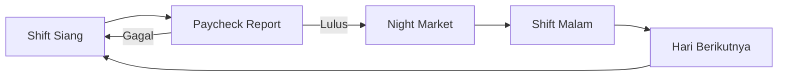

# Game Design Document
## Where Do You Belong?

---

## Daftar Isi

1. [Summary](#summary)
2. [Settings](#settings)
3. [Gameplay](#gameplay)
4. [Aesthetics](#aesthetics)

---

## Summary

### Game Information

| Field | Detail |
|---|---|
| **Title** | Where Do You Belong? |
| **Developer** | tim yang serius |
| **Engine** | Godot 4.7 |
| **Platform** | PC |
| **Genre** | Deductive Puzzle / Narrative |
| **Target Audience** | 13+ — pemain yang suka game puzzle berbasis logika dan narasi |

---

### Elevator Pitch

> Kamu mati karena kesalahan administratif malaikat — padahal belum waktunya.
> Masalahnya: pas ditimbang, dosa lebih berat dari kebaikan.
> Sekarang ada satu tawaran — kerja sebagai **konduktor intern** di kereta penyeberangan antar dunia selama 5 hari.
> **Berhasil → Surga. Gagal → Neraka.**

*Where Do You Belong?* adalah game 2D deductive puzzle side-view. Player memeriksa dokumen penumpang, mendeteksi anomali (penumpang yang sudah meninggal tapi menyamar), dan memandu jiwa-jiwa tersesat ke stasiun yang tepat — dalam satu kereta yang sama.

---

### Theme Implementation

**Tema: "After the End"** *(GameToday 2026)*

Tema diimplementasikan di berbagai lapisan game:

- **Protagonis** — Sudah mati, tapi perjalanannya baru dimulai dari sini. Seluruh game terjadi *setelah akhir* hidupnya.
- **Penumpang anomali** — Jiwa-jiwa yang belum tahu harus ke mana setelah mati. Player yang memutuskan.
- **Kereta** — Berjalan antara dunia manusia (siang) dan dunia arwah (malam). Satu kendaraan, dua realitas.
- **Siang → Malam** — Setiap hari selalu ada "after the end" baru, bukan hanya milik protagonis, tapi juga tiap jiwa yang ditemui.

---

### Unique Selling Point

Dua fase gameplay yang berbeda tapi saling terhubung:

| | Shift Siang | Shift Malam |
|---|---|---|
| **Aktivitas** | Inspeksi dokumen, deteksi anomali, cap penumpang | Baca biografi jiwa, temukan clue, susun di peta konstelasi |
| **Konsekuensi** | Penalti langsung atas setiap kesalahan | Reward hanya cair jika semua penempatan benar |
| **Suasana** | Sibuk, birokrasi, tekanan waktu | Tenang, investigatif, deduktif |

Selain itu, ada beberapa hal yang membedakan game ini:

- **Signature mechanic** — Player men-trace tanda tangan untuk mengonfirmasi bahwa tugasnya di satu segmen rute sudah selesai. Bukan sekadar tombol konfirmasi, tapi pernyataan resmi dari konduktor.
- **Ekonomi Blessings** — Penghasilan dari shift siang dipakai untuk beli tool di Night Market sebelum shift malam dimulai.
- **Narasi lewat dokumen** — Tidak ada cutscene eksposisi panjang. Dunia dikenalkan lewat dialog malaikat, isi dokumen, dan temuan player sendiri.

---

## Settings *(opsional)*

### Worldbuilding

Dunia game ini dibagi menjadi beberapa ruang yang berbeda tapi berada dalam satu kerangka:

- **Mortal Realm** — Dunia manusia. Direpresentasikan oleh suasana siang di dalam kereta, dengan penumpang biasa yang punya dokumen dan tujuan jelas.
- **Soul Line** — Jalur khusus yang hanya bisa diakses saat kereta masuk malam. Di sinilah jiwa-jiwa anomali tampak dan menunggu untuk ditempatkan.
- **Night Market** — Pasar di antara dua dunia, muncul setelah shift siang berakhir. Player bisa membeli tool di sini menggunakan Blessings yang sudah dikumpulkan.

Kereta beroperasi di rute tetap dengan 4 stasiun aktif: **Alderwick → Brambleford → Cinderfield → Dunmere**, dengan Eastmere sebagai terminal akhir yang tidak masuk dalam operasi shift siang.

---

### Story

Seorang pelamar kerja meninggal di tengah jalan menuju interview — bukan karena takdir, tapi karena **kesalahan pencatatan malaikat**. Dia seharusnya belum mati saat itu.

Masalahnya, saat jiwa ditimbang, **dosa lebih berat dari kebaikan**. Jadi dia tidak bisa langsung naik ke surga.

Malaikat, yang merasa punya tanggung jawab atas kesalahannya, menawarkan satu jalan keluar: bekerja sebagai **konduktor intern di kereta penyeberangan antar dunia selama 5 hari**. Kalau berhasil menyelesaikan internship — masuk surga. Kalau gagal — neraka.

Tidak ada pilihan lain. Player mulai bekerja dari Hari 1.

---

### Characters

**Protagonis (Player)**
Konduktor intern yang mati sebelum waktunya. Tidak punya dialog — semua keputusan ada di tangan player. Latar belakangnya sengaja dibuat minimal agar player bisa merasa menjadi karakter itu sendiri.

**Malaikat**
Supervisor sekaligus guide. Muncul di awal untuk menjelaskan aturan, dan sesekali muncul lagi saat ada hal penting yang perlu disampaikan. Nadanya formal tapi tidak kaku — lebih ke atasan yang profesional.

**Penumpang**
Terbagi dua:
- **Penumpang biasa (hidup)** — Punya ID dan tiket valid. Harus dicap dan diturunkan di stasiun yang benar.
- **Anomali (mati)** — Penumpang yang sebenarnya sudah meninggal, tapi ikut menyamar di antara yang hidup. Ada 5 jenis anomali, masing-masing dikenali dengan cara berbeda.

---

## Gameplay

### Core Loop

Setiap hari terdiri dari dua fase: **shift siang** dan **shift malam**. Shift siang berfokus pada inspeksi dan pengelolaan penumpang, sementara shift malam berfokus pada penyelesaian teka-teki jiwa. Kedua fase ini harus diselesaikan untuk melanjutkan ke hari berikutnya.

---

### Game Objective

- **Jangka pendek** — Selesaikan setiap shift siang dengan net earnings yang memenuhi daily target. Target naik tiap hari: 100 / 120 / 140 / 160 / 180 Blessings.
- **Jangka panjang** — Selesaikan 5 hari internship untuk mendapat ending yang baik.

---

### Game Mechanics

#### 1. Eksplorasi Kereta

Player bergerak secara horizontal di dalam kereta (side-view 2D). Semua gerbong bisa diakses bebas. Player mendekati penumpang untuk mulai berinteraksi dan membuka dokumen mereka.

| Input | Fungsi |
|---|---|
| **A / D** atau **← →** | Berjalan |
| **E** | Interaksi dengan penumpang atau objek |
| **Tab** | Buka / tutup Guidebook |
| **Esc** | Tutup UI aktif / pause |

---

#### 2. Inspeksi Dokumen

Setiap penumpang membawa dokumen yang bisa dibuka dan dibaca. Player perlu membandingkan informasi antar dokumen untuk menemukan ketidaksesuaian.

| Dokumen | Isi |
|---|---|
| **Identity Card (ID)** | Nama, foto, nomor ID, tempat & tanggal lahir, pekerjaan |
| **Tiket** | Nomor kereta, tanggal keberangkatan, stasiun tujuan, kode tiket |
| **Koran** | Kolom berita dan obituari yang bisa jadi clue anomali |

---

#### 3. Stamping (Pengecapan)

Setelah memeriksa dokumen, player memutuskan apakah akan mencap penumpang atau tidak. Penumpang yang dicap akan diturunkan di stasiun yang tertulis di stampnya. Anomali tidak boleh dicap — mereka harus tetap di kereta untuk shift malam.

Efek ke Paycheck:

| Kejadian | Blessings |
|---|---|
| ✅ Drop-off benar | **+30** |
| ❌ Drop-off salah | **−20** |
| ❌ Anomali salah dicap | **−40** |

---

#### 4. Deteksi Anomali

Ada 5 jenis anomali — semuanya adalah orang yang sudah meninggal tapi menyamar sebagai penumpang biasa. Tidak ada label otomatis; player harus menyimpulkan sendiri berdasarkan bukti yang ditemukan.

| Jenis Anomali | Cara Deteksi |
|---|---|
| **Shadowless** | Tidak punya bayangan di lantai |
| **Portrait Mismatch** | Foto di ID tidak cocok dengan wajah penumpang |
| **Newspaper Death** | Nama penumpang ada di kolom obituari koran |
| **Unlisted Destination** | Stasiun tujuan di tiket tidak termasuk rute aktif |
| **Time-Invalid Ticket** | Tanggal di tiket tidak valid atau tidak masuk akal |

---

#### 5. Route Sign-Off

Setelah selesai memeriksa penumpang di satu segmen perjalanan, player menandatangani rute sebagai konfirmasi bahwa tugasnya di segmen itu sudah selesai. Player men-trace pola tanda tangan di layar — jika berhasil, kereta melanjutkan perjalanan ke stasiun berikutnya; jika gagal, player harus coba ulang.

---

#### 6. Night Market

Sebelum shift malam dimulai, player masuk ke Night Market dan bisa menggunakan Blessings dari shift siang untuk membeli tool.

| Tool | Harga | Fungsi |
|---|---|---|
| **Veil Note** | 200 Blessings | Membuka informasi tersembunyi tentang jiwa di shift malam |
| **Radar Charge** | 150 Blessings | Membantu mendeteksi anomali yang sulit ditemukan |
| **Swiftstep** | 75 Blessings | Menambah kecepatan jalan player selama 10 detik |

Tool yang tidak terpakai terbawa ke hari berikutnya. Jika shift siang gagal, semua pembelian dibatalkan.

---

#### 8. Soul Line — Shift Malam

Saat kereta masuk Soul Line, penumpang biasa menghilang. Yang tersisa hanya jiwa-jiwa anomali dari shift siang. Player membaca **Soul Record** (biografi tiap jiwa) untuk menemukan **clue statement** — kalimat tertentu yang jadi petunjuk ke stasiun yang benar. Setelah itu, player men-drag jiwa ke node stasiun di **Constellation Map**.

Reward shift malam:

| Kejadian | Blessings |
|---|---|
| ✅ Penempatan jiwa benar | **+100** per jiwa |
| 📄 Clue statement ditemukan | **+50** per clue |

Penempatan yang salah bisa diulang. Reward hanya cair jika semua jiwa berhasil ditempatkan dan shift selesai.

---

#### 9. Paycheck Report

Di akhir shift siang, player mendapat laporan kinerja yang menampilkan total Blessings dari drop-off benar, potongan dari drop-off salah dan anomali yang salah dicap, serta **net earnings** yang dibandingkan dengan **daily target**.

- **PASSED** → Blessings cair, lanjut ke Night Market.
- **FAILED** → Tidak dapat Blessings, shift harus diulang dari awal.

---

### Progression

| Hari | Daily Target |
|---|---|
| Day 1 | 100 Blessings |
| Day 2 | 120 Blessings |
| Day 3 | 140 Blessings |
| Day 4 | 160 Blessings |
| Day 5 | 180 Blessings |

Target naik tiap hari. Seiring berjalannya hari, jumlah penumpang bertambah dan anomali yang muncul semakin sulit untuk dideteksi.

---

## Aesthetics

### Art Direction

Gaya visual 2D ilustratif dengan dua palet yang kontras antara siang dan malam.

- **Shift Siang** — Palet hangat (sepia, amber, krem). Kesan Victorian — penumpang berpakaian formal, interior kereta kayu gelap, cahaya masuk dari jendela.
- **Shift Malam / Soul Line** — Palet dingin (biru tua, ungu). Gerbong yang sama terasa sepi dan asing — ada efek partikel konstelasi di latar.
- **UI** — Bersih dan minimalis. Font serif untuk dokumen (terasa seperti surat resmi), sans-serif untuk HUD. Guidebook tampil seperti buku fisik.

---

### Audio Direction

- **Ambient Siang** — Suara roda kereta di rel, derit gerbong, suara penumpang yang samar-samar.
- **Ambient Malam** — Lebih hening — suara angin rendah dan melodi string yang melankolis.
- **UI Feedback** — Suara cap saat stamping, gemerisik dokumen saat dibuka, notifikasi halus, suara tegas saat tanda tangan ditolak.
- **Musik** — Orkestra ringan untuk siang, ambient untuk malam. Musik mengikuti suasana, tidak terlalu menonjol.

---

### References *(opsional)*

| Game | Elemen yang Direferensikan |
|---|---|
| **Papers, Please** | Inspeksi dokumen, mechanic stamping, tekanan dari sistem birokrasi |
| **Return of the Obra Dinn** | Deductive logic dari dokumen dan bukti fisik |
| **Disco Elysium** | Narasi yang terungkap lewat teks dan interaksi, bukan cutscene panjang |
