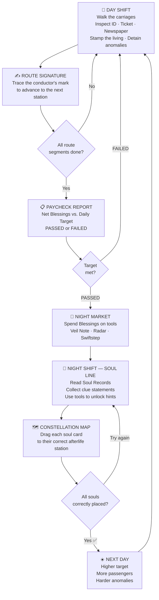
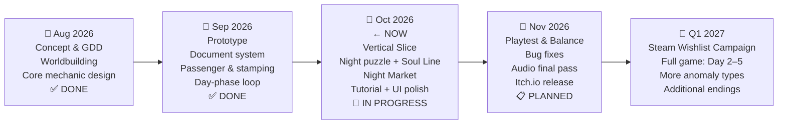

# WHERE DO YOU BELONG?
### Pitch Deck — GameToday 2026
**Theme: "After the End"**

---

## Slide 1 — The Hook

> **What if the only way to get into heaven was to become a dead bureaucrat on a ghost train?**

You died on your way to a job interview.
Not your fault — an angel made a clerical error.

The bad news: your sins outweigh your good deeds.
There's no express lane. No appeal.

**But there's one offer on the table.**

Work five days as an intern conductor on a train that runs between the living world and the realm of the dead.
Check documents. Catch the dead who are pretending to be alive.
Send every soul to exactly where they belong.

*Succeed → Heaven. Fail → Hell.*

---

## Slide 2 — Title & Overview

```
╔══════════════════════════════════════════════╗
║                                              ║
║         WHERE DO YOU BELONG?                 ║
║                                              ║
║  "Papers, Please meets Return of the         ║
║   Obra Dinn — on a supernatural train."      ║
║                                              ║
║  Genre   : Deductive Puzzle / Narrative Sim  ║
║  Platform : PC (Windows / Linux / Mac)       ║
║  Engine   : Godot 4.7 (Open Source)          ║
║  Status   : Playable Vertical Slice          ║
║                                              ║
╚══════════════════════════════════════════════╝
```

> **[KEY ART PLACEHOLDER]** — A dimly lit train carriage split between warm sepia daylight on the left and cold blue-purple spirit-realm darkness on the right. A lone conductor silhouette stands in the middle.

---

## Slide 3 — About Us

### *tim yang serius* — A Studio That Means Business

A small team built around one shared belief: the best games are born from questions that are hard to answer.

| Name | Role |
|---|---|
| *(name)* | Game Designer & Producer |
| *(name)* | Lead Programmer — Godot / GDScript |
| *(name)* | Art Director & Visual Design |
| *(name)* | Composer & Sound Design |

**What we bring:**
- ✅ Playable vertical slice — Day 1 fully implemented
- ✅ Full document inspection system + 5 anomaly types
- ✅ Day/Night dual-phase loop — both phases functional
- ✅ Signature mechanic, Night Market, Constellation Map puzzle — all in-engine

> We ship. We can show you the build today.

---

## Slide 4 — Game Overview

### A Two-World Train Journey

*Where Do You Belong?* is a **2D side-view deductive puzzle game** set aboard a train that travels between the human world and the spirit realm.

You play as a newly dead intern conductor. Your job: inspect passenger documents, identify souls masquerading as the living, and guide anomalies to their correct afterlife station — before your 5-day contract ends.

### The World

The train runs a fixed route:
**Alderwick → Brambleford → Cinderfield → Dunmere**

- **Daytime** — Warm sepia lighting. Victorian formality. Ordinary passengers with documents to check, stamps to issue, and a timetable to keep.
- **Night / Soul Line** — The living vanish. Cold blue-purple fills the carriages. Only the detained souls remain, waiting for judgment.

### What Does It Feel Like?

| | Day Shift | Night Shift |
|---|---|---|
| **Mood** | Busy, bureaucratic, under pressure | Quiet, investigative, contemplative |
| **Player Action** | Inspect documents, stamp tickets, catch anomalies | Read soul biographies, gather clues, place souls on the Constellation Map |
| **Stakes** | Instant penalty per mistake | All-or-nothing reward at the end |

---

## Slide 5 — Unique Selling Points

### What Makes This Game Different?

**① Two-Phase Duality — One Decision, Two Consequences**
Every anomaly you catch (or miss) in the day becomes a puzzle you have to solve at night. The two phases are inseparable — your daytime accuracy sets the ceiling for your nighttime reward. No other document-inspection game does this.

---

**② The Signature Mechanic — Authority Has Weight**
To move the train between stations, the player physically traces a conductor's signature on screen. It's not a "confirm" button. It's a declaration. Fail the trace and the train doesn't move. It makes every departure feel earned.

---

**③ The Blessings Economy — Choose Your Tools**
Your daytime earnings buy tools in the **Night Market** before the shift turns dark:

| Tool | Cost | Effect |
|---|---|---|
| Veil Note | 200 Blessings | Unlocks hidden clue in a soul's biography |
| Radar Charge | 150 Blessings | Highlights hard-to-spot anomalies |
| Swiftstep | 75 Blessings | Movement speed boost for 10 seconds |

Miss the daily target → all purchases cancelled → replay from the start.

---

**④ No Cutscenes. All Story.**
The world is built entirely through documents, newspapers, soul records, and angel dialogue. Players discover the lore themselves. Nothing is handed to them.

---

**⑤ Five Anomaly Types — Each Requires a Different Eye**

| Anomaly | How to Spot It |
|---|---|
| **Shadowless** | No shadow on the floor |
| **Portrait Mismatch** | ID photo doesn't match the passenger's face |
| **Newspaper Death** | Passenger's name appears in the obituary column |
| **Unlisted Destination** | Ticket destination isn't on the active route |
| **Time-Invalid Ticket** | Travel date is impossible or expired |

---

## Slide 6 — Core Loop



**Daily Targets:**
| Day | Blessings Required |
|---|---|
| Day 1 | 250 |
| Day 2 | 300 |
| Day 3 | 350 |
| Day 4 | 400 |
| Day 5 | 400 + Final Judgment |

---

## Slide 7 — Market Analysis

### Who Is Playing This?

---

**Persona A — The Logic Puzzle Player** *(Core Audience)*

> *"I want to feel smart when I figure it out — not just lucky."*

- **Age:** 18–30
- **Plays:** Papers, Please · Obra Dinn · Baba Is You · Suzerain
- **Platform:** PC / Steam
- **Motivation:** Satisfaction of deduction, not reflex. Wants to earn the answer.
- **Frustration:** Puzzles with no internal logic, or narrative that feels disconnected from mechanics.

---

**Persona B — The Story-First Gamer** *(Secondary Audience)*

> *"If the world feels real, I'll play for hours just reading documents."*

- **Age:** 20–35
- **Plays:** Disco Elysium · Heaven's Vault · 80 Days · Pentiment
- **Platform:** PC / occasionally console
- **Motivation:** Atmosphere, character, and a world that rewards curiosity.
- **Frustration:** Games with great lore locked behind skill walls, or puzzles that interrupt the story.

---

**Persona C — The Indie Explorer** *(Reach Audience)*

> *"I found my last five favorite games on Itch.io for free."*

- **Age:** 16–25
- **Plays:** Unpacking · Stardew Valley · game jam titles
- **Platform:** Itch.io, then Steam
- **Motivation:** Unique aesthetic, short-to-medium play sessions, emotional payoff.
- **Frustration:** Games that are too long, too punishing, or require too much setup.

---

### Benchmark — Proof of Market

| Title | Est. Copies Sold | Steam Rating | Price |
|---|---|---|---|
| *Papers, Please* (2013) | **2M – 4.9M** | 97% Positive | $9.99 |
| *Return of the Obra Dinn* (2018) | **300K – 1.5M** | 97% Positive | $19.99 |
| *Disco Elysium* (2019) | ~1M | 97% Positive | $39.99 |

> **The "97% club" is real.** Document-inspection and deductive games consistently reach the top of their genre because their audiences are deeply invested. These aren't impulse purchases — they're word-of-mouth titles with long commercial tails.
>
> Indie games now represent ~48% of Steam's total game revenue. *Where Do You Belong?* targets the premium single-player narrative segment — low competition volume, high loyalty.

---

### Comparative Feature Analysis

| Feature | *Where Do You Belong?* | *Papers, Please* | *Obra Dinn* | *Disco Elysium* |
|---|:---:|:---:|:---:|:---:|
| Document Inspection | ✅ | ✅ | ✅ | ❌ |
| Deductive Logic Puzzle | ✅ | ⚠️ Rule-based | ✅ | ⚠️ Skill checks |
| Two-Phase Gameplay Loop | ✅ | ❌ | ❌ | ❌ |
| Narrative via Documents | ✅ | ⚠️ Minimal | ✅ | ✅ |
| In-game Economy System | ✅ Blessings | ✅ Peso | ❌ | ❌ |
| Supernatural / Afterlife Setting | ✅ | ❌ | ⚠️ | ❌ |
| Physical Gesture Mechanic | ✅ Signature trace | ❌ | ❌ | ❌ |
| Accessible Entry Point | ✅ | ⚠️ Steep curve | ⚠️ Steep | ❌ Very slow |

> *Where Do You Belong?* is the only game in this tier with a **linked dual-phase structure** — where your choices in one phase directly shape the rules of the next.

---

## Slide 8 — Why Now?

### The Moment Is Right

**① The "document game" genre has proven demand — but no supernatural entry.**
*Papers, Please* redefined the genre in 2013. *Obra Dinn* deepened it in 2018. Both achieved 97%+ ratings and long-tail commercial success. No major entry has brought an afterlife/supernatural angle to this formula — that gap is open.

**② Short-form premium indie games are having a moment.**
Titles like *Unpacking*, *Norco*, and *A Short Hike* have demonstrated that games with strong thematic identity and 3–6 hour runtimes outperform expectations on Steam. Players are hungry for focused, complete experiences.

**③ Godot 4.x is now a credible shipping engine.**
Recent titles shipped on Godot 4 have proven the toolchain is production-ready. Our team has built all core systems — document inspection, anomaly detection, night puzzle, market economy — from scratch in Godot 4.7.

**④ The "After the End" theme is universally resonant.**
Everyone has thought about what comes next. We're not making a game about death — we're making a game about *accountability*. That hits differently.

---

## Slide 9 — Development Timeline



| Milestone | Status | Target |
|---|---|---|
| GDD & Worldbuilding | ✅ Complete | Aug 2026 |
| Core Loop Prototype | ✅ Complete | Sep 2026 |
| Vertical Slice — Day 1 Playable | 🔄 In Progress | Oct 2026 |
| Night Puzzle & Soul Line | 🔄 In Progress | Oct 2026 |
| Tutorial System | 🔄 In Progress | Oct 2026 |
| Audio Final Implementation | 📋 Planned | Nov 2026 |
| Public Itch.io Release | 📋 Planned | Nov 2026 |
| Steam Wishlist & Full Game | 📋 Planned | Q1 2027 |

---

## Slide 10 — The Ask & Close

### What We Need

| Support Type | Details |
|---|---|
| **Competition Recognition** | Validation to carry the project forward to full release |
| **Mentorship / Network** | Access to industry contacts for playtesting and publishing conversations |
| **Visibility** | Itch.io / Steam featuring, gaming press introduction |

We are not asking you to take a risk on an idea.
**We're showing you a working game.** The systems are built. The loop is playable. The story is in motion.

---

### Why This Game Deserves to Exist

We all carry some version of that question.
*"Am I doing enough?"*
*"Do I belong here?"*

*Where Do You Belong?* turns that anxiety into a mechanic.
Not by answering the question for the player — but by asking them to answer it for everyone else first.

Every soul you place correctly.
Every document you read carefully.
Every anomaly you catch before the train moves on.

It all adds up to the same thing:
**You were present. You paid attention. You did the work.**

Maybe that's enough.

---

> *"A game about finding the right place for everyone else — so you can finally find yours."*

---

### Contact

| | |
|---|---|
| **Itch.io / Demo Build** | *(link)* |
| **Email** | *(email)* |
| **Social** | *(handle)* |
| **Press Kit** | *(link to folder with build + screenshots + trailer)* |

---

*Thank you — GameToday 2026*

---

> **Best Practices Applied:**
> - Hook-first structure (emotional before technical)
> - "X meets Y" descriptor on title slide
> - Player actions described, not features listed
> - Real market data with source context (SteamSpy / Gamalytic estimates)
> - Clear "The Ask" slide with specific, realistic requests
> - Deck closes with emotional resonance matching game theme
> - Max ~10 slides — concise enough for a 5–7 minute read
