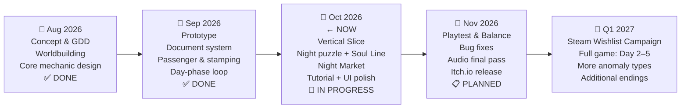

# WHERE DO YOU BELONG?
### Pitch Deck — GameToday 2026
**Theme: "After the End"**

---

## Slide 1 — The Hook

> **What if, After the End of the shift, your real work has only just begun?**

---

The day shift is over. The last station has been reached.
Every passenger stamped, checked, sent off.

Except not all of them.

Some of the people on this train were never really alive to begin with.
They're still here. Still in their seats. Still waiting.
And they have no idea where they belong.

That's where you come in.

*You died on the way to your job interview. An angel made a clerical error.*
*Your sins outweigh your good deeds. There's no express lane.*

But there's one offer on the table:
work five days as an intern conductor on a train between the living world and the dead —
catch the souls disguising themselves as passengers,
and when the line ends, assign every one of them to where they truly belong.

**Succeed → Heaven. Fail → Hell.**

---

## Slide 2 — Title & Overview

```
╔══════════════════════════════════════════════╗
║                                              ║
║         WHERE DO YOU BELONG?                 ║
║                                              ║
║  "Papers, Please meets Return of the         ║
║   Obra Dinn — on a supernatural train."      ║
║                                              ║
║  Genre   : Deductive Puzzle / Narrative Sim  ║
║  Platform : PC (Windows / Linux / Mac)       ║
║  Engine   : Godot 4.7 (Open Source)          ║
║  Status   : Playable Vertical Slice          ║
║                                              ║
╚══════════════════════════════════════════════╝
```

> **[KEY ART PLACEHOLDER]** — A dimly lit train carriage split down the middle: warm Victorian sepia on the left (the living world, the day shift), cold blue-purple constellation darkness on the right (the soul line, after the end of the line). A lone conductor silhouette stands at the divide — facing right.

---

## Slide 3 — About Us

### *tim yang serius* — A Studio That Means Business

A small team built around one shared belief: the best games ask questions they don't immediately answer.

| Name | Role |
|---|---|
| *(name)* | Game Designer & Producer |
| *(name)* | Lead Programmer — Godot / GDScript |
| *(name)* | Art Director & Visual Design |
| *(name)* | Composer & Sound Design |

**What we bring:**
- ✅ Playable vertical slice — Day 1 fully implemented
- ✅ Full document inspection system + 5 anomaly types
- ✅ Day/Night dual-phase loop — both phases functional
- ✅ Signature mechanic, Night Market, Constellation Map — all in-engine

> We ship. We can show you the build today.

---

## Slide 4 — Game Overview

### The End of the Line Is Not the End

*Where Do You Belong?* is a **mystery game set on a ghost train, where you inspect documents, catch the dead hiding among the living, and decide where each soul belongs.**

You play as a newly dead intern conductor. During the day, the job looks normal — walk the carriages, check documents, stamp tickets, keep the train on schedule. Except some of the passengers shouldn't be here. They're dead, and they're pretending not to be.

When the route ends and the living step off, the ones you kept stay behind. That's when the real work starts.

The theme is "After the End" — and it runs through everything:

| | What Ends | What's Still Left to Do |
|---|---|---|
| **The Protagonist** | Their life — cut short by an angel's mistake | Five days of work to earn a place in the afterlife |
| **The Day Shift** | The route ends. Stamps done. Train stops. | The souls are still on board. Night begins. |
| **Each Anomaly** | Their life in the human world | They don't know where they're going — you decide |

### The World

Fixed daytime route: **Alderwick → Brambleford → Cinderfield → Dunmere**

- **Day / Mortal Realm** — Warm sepia. Victorian interiors. Passengers with ID cards, train tickets, and newspapers. Busy and bureaucratic.
- **Night / Soul Line** — The living are gone. Cold blue-purple. Constellation particles outside the windows. Just you, the dark, and the souls you held back.

### What Does It Feel Like?

| | Day Shift | Night Shift |
|---|---|---|
| **Mood** | Busy, under pressure, no time to second-guess | Quiet, slow, investigative |
| **What you do** | Inspect IDs, tickets, newspapers · Stamp the living · Hold back the dead | Read Soul Records · Find clues · Place each soul on the Constellation Map |
| **Stakes** | Wrong call = immediate penalty | Get everyone right, or you get nothing |

---

## Slide 5 — Unique Selling Points

### What Makes This Game Different?

---

**① Document Inspection — Every Passenger Is a Case to Crack**

Players walk the carriages, pull out ID cards, cross-check tickets, and skim newspaper obituaries — all in real time. Each document is a clue. Each inconsistency is a decision. Stamp the wrong person and you pay for it. Miss an anomaly and you'll face it again at night.

The core loop isn't just "check papers." It's *reading between the lines under pressure.*

| Document | What to Look For |
|---|---|
| **Identity Card** | Name, face, ID number, date of birth |
| **Train Ticket** | Destination, travel date, route validity |
| **Newspaper** | Obituary column — is this passenger already dead? |

---

**② Send Them Where They Belong**

The dead don't disappear at the end of the line. They stay on the train — because you kept them there.

During the day shift, the player's job is to **stay aware**: spot the souls hiding among the living before the train moves on. Miss one and they slip through. Catch them and they're yours to deal with at night.

When the route ends and the living step off, the real work starts. Each detained soul needs to go somewhere — and it's the player's job to figure out where that is. Read their story. Find the truth in it. Send them where they actually belong.

```
  STAY AWARE   →  notice the anomalies among the living
       ↓
  DETAIN THEM  →  keep them on the train past the last stop
       ↓
  FOLLOW THROUGH  →  read their story, find where they belong
       ↓
  SEND THEM HOME  →  place each soul at the right destination
```

---

**③ The Shift Doesn't Always Go as Planned**

Mid-inspection, things go wrong. A pile of luggage has fallen and is blocking the door between carriages — nobody can pass until it's sorted. Or a passenger refuses to let you check their ticket until you deal with the filth on their seat first.

These aren't just flavor. They interrupt the clock, eat into inspection time, and force the player to context-switch mid-shift.

| Disruption | What Happens |
|---|---|
| **Blocked Aisle** | Luggage has spilled across the carriage door. Solve the packing puzzle to clear the path. |
| **Dirty Seat** | A passenger won't cooperate until the seat is cleaned. Wipe it down to proceed. |

Miss the window to deal with them — the carriage stays blocked, the passenger stays uncooperative, and time keeps moving.

---

**④ Five Anomaly Types — Each Needs a Different Eye**

Anomalies don't announce themselves. Players have to notice. Each of the five types requires a different kind of attention — visual, documentary, logical.

| Anomaly | How to Spot It |
|---|---|
| **Shadowless** | No shadow on the floor |
| **Portrait Mismatch** | ID photo doesn't match the face in front of you |
| **Newspaper Death** | Passenger's name is in the obituary column |
| **Unlisted Destination** | Ticket destination isn't on the active route |
| **Time-Invalid Ticket** | Travel date is impossible or expired |

---

**⑤ Work Toward the Good Ending — Five Days, One Shot**

The player has exactly five days to prove they deserve to go to Heaven.
Every day, the target climbs. Every day, the anomalies get harder to catch.

Clear all five days → **Heaven Ending.**
Fail to meet the target → the shift replays.
Fail too many times → **Hell Ending.**

There's no freeplay. No sandbox. Every decision is made knowing exactly what's riding on it.

---


## Slide 6 — Core Loop

**🌅 DAY SHIFT**
Walk the carriages. Inspect each passenger's ID card, train ticket, and the day's newspaper.
Stamp the living and send them off at the right station.
Spot the anomalies — the dead hiding among the living — and detain them on the train.

↓

**📋 PAYCHECK REPORT**
At the end of the route, net Blessings are tallied against the daily target.
Miss the target → the shift replays from the beginning.
Hit the target → move on.

↓

**🏪 NIGHT MARKET**
In the window between shifts, spend Blessings on tools for the night ahead —
*Veil Note*, *Radar Charge*, or *Swiftstep*.

↓

**🌌 NIGHT SHIFT — SOUL LINE**
The living are gone. Only the detained souls remain.
Read each Soul Record. Find the clue buried in their story.
Use tools to surface hints that aren't immediately visible.

↓

**🗺️ CONSTELLATION MAP**
Drag each soul card to the afterlife station that fits who they were.
Wrong placement → go back, re-read, try again.
All souls correctly placed → the shift truly ends.

↓

**☀️ NEXT DAY**
The daily target climbs. More passengers board.
Anomalies get harder to catch. Repeat.


| Day | Daily Target |
|---|---|
| Day 1 | 250 Blessings |
| Day 2 | 300 Blessings |
| Day 3 | 350 Blessings |
| Day 4 | 400 Blessings |
| Day 5 | 400 Blessings + Final Judgment |

---

## Slide 7 — Market Analysis

### Who Is Playing This?

---

**Persona 1 — The Thoughtful Player** *(Core Audience)*

> *"I want a game that trusts me enough to let me figure things out myself."*

| | |
|---|---|
| **Age** | 18–35 |
| **Platform** | PC (Steam / Itch.io) |
| **Session Length** | 1–4 hours — tends to lose track of time when the atmosphere is strong |
| **Play Frequency** | 2–5x per week, usually evenings or late night |
| **Favourite Titles** | Papers, Please · Return of the Obra Dinn · Disco Elysium · Outer Wilds · Pentiment · Heaven's Vault · Suzerain |

**Demographics:**
Usually in their 20s or early 30s, studying or working in something creative or analytical. Reads books too — not instead of games, but alongside them. Has a backlog, doesn't feel guilty about it. The kind of person who recommends games like they're recommending films.

**Psychographics:**
- Prefers one good game over five okay ones
- Pays attention to things most players skip — environmental details, document text, optional dialogue
- Genuinely enjoys the moment of figuring something out, not being told the answer
- Slow to start a new game, but hard to pull away once they're in
- Talks about finished games for months — word-of-mouth is how they share everything

**Play Habits:**
Reads every document. Takes notes. Backtracks when they realize they missed something. Doesn't rush the atmosphere. Wants to understand the world, not just complete it.

**How They Find Games:**
YouTube deep-dives, Steam reviews, Reddit threads, trusted recommendations. A strong premise in two sentences gets them. Key art that feels intentional keeps them.

**Frustration:**
Puzzles that are arbitrary. Lore locked behind difficulty. Being nudged toward a solution they were about to find themselves. Mechanics that feel bolted onto the story instead of part of it.

**Why This Game:**
Every call they make during the day shift echoes into the night puzzle — there's no reset, no undo. The world tells its story through documents, not cutscenes. And the two-phase structure means their attention always has somewhere to land.


---


### Benchmark — Proof of Market

| Title | Est. Copies Sold | Steam Rating | Avg. Playtime |
|---|---|---|---|
| *Papers, Please* (2013) | **2M – 4.9M** | 97% Positive | ~5–8 hrs |
| *Return of the Obra Dinn* (2018) | **300K – 1.5M** | 97% Positive | ~8–10 hrs |
| *Disco Elysium* (2019) | ~1M | 97% Positive | ~30–60 hrs |

> Games like *Papers, Please* and *Obra Dinn* both hit 97%+ ratings and have been selling for years. The audience for this genre is real, loyal, and doesn't leave after the first week. They finish the game. They talk about it. They recommend it.

---

### Comparative Feature Analysis

| Feature | *Where Do You Belong?* | *Papers, Please* | *Obra Dinn* | *Disco Elysium* |
|---|:---:|:---:|:---:|:---:|
| Document Inspection | ✅ | ✅ | ✅ | ❌ |
| Deductive Logic Puzzle | ✅ | ⚠️ Rule-based | ✅ | ⚠️ Skill checks |
| **Linked Two-Phase Loop** | ✅ | ❌ | ❌ | ❌ |
| Narrative via Documents Only | ✅ | ⚠️ Minimal | ✅ | ✅ |
| In-game Economy System | ✅ Blessings | ✅ Peso | ❌ | ❌ |
| Supernatural / Afterlife Setting | ✅ | ❌ | ⚠️ | ❌ |
| Accessible Entry Point | ✅ | ⚠️ Steep | ⚠️ Steep | ❌ Very slow |

> The one thing none of these games do: carry your daytime choices directly into a second phase and make you solve them there. That's the gap this game fills.

---

## Slide 8 — Why Now?

**The document inspection genre has an open lane.**
*Papers, Please* (2013) and *Obra Dinn* (2018) proved the formula works. Neither went anywhere near the supernatural. Nobody has. That space is still empty.

**Short games are doing well right now.**
*Unpacking*, *A Short Hike*, *Venba* — games with a clear identity and a runtime under six hours are consistently outperforming expectations. Players aren't looking for more content. They're looking for something that actually lands.

**The theme fits the moment.**
"After the End" isn't abstract. It's about what still needs to be done after something finishes — and that's a question that doesn't go out of style.

**We already have a working build.**
Document inspection, anomaly detection, night puzzle, market economy, tutorial — all of it is in Godot 4.7 and running. This isn't a pitch for a concept. It's a pitch for a game that exists.

---

## Slide 9 — Development Timeline



| Milestone | Status | Target |
|---|---|---|
| GDD & Worldbuilding | ✅ Complete | Aug 2026 |
| Core Loop Prototype | ✅ Complete | Sep 2026 |
| Vertical Slice — Day 1 Playable | 🔄 In Progress | Oct 2026 |
| Night Puzzle & Soul Line | 🔄 In Progress | Oct 2026 |
| Tutorial System | 🔄 In Progress | Oct 2026 |
| Audio Final Implementation | 📋 Planned | Nov 2026 |
| Public Itch.io Release | 📋 Planned | Nov 2026 |
| Steam Wishlist & Full Game | 📋 Planned | Q1 2027 |

---

## Slide 10 — Close

### The Shift Doesn't End When the Route Does

Most games about death ask you to feel something about it.

*Where Do You Belong?* asks you to do something about it.

The day shift ends. The last station is reached. The living passengers step off.
But the work isn't done — because a few of them weren't really alive.
They're still on the train. Still waiting. And they need to go somewhere.

That's what "After the End" means here.
Not just that the protagonist died.
Not just that each soul's life is over.
But that **the end of one thing** — the route, the shift, the life — **is always the beginning of something that still has to be finished.**

Every soul correctly placed is a life that finally has somewhere to go.
Every document carefully read is an act of attention that changes someone's eternity.

**The shift ends when every soul belongs somewhere.**

*So do you.*

---

> *"Where Do You Belong? — The shift isn't over until every soul has a place."*

---

### Contact

| | |
|---|---|
| **Itch.io / Demo Build** | *(link)* |
| **Email** | *(email)* |
| **Social** | *(handle)* |
| **Press Kit** | *(folder: build · screenshots · trailer)* |

---

*Thank you — GameToday 2026*
