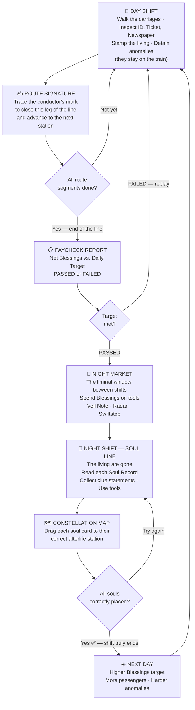
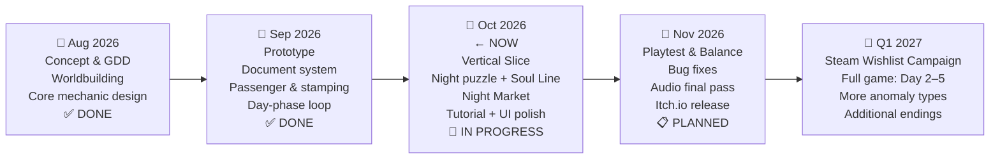

# WHERE DO YOU BELONG?
### Pitch Deck — GameToday 2026
**Theme: "After the End"**

---

## Slide 1 — The Hook

> **What happens After the End of the line — when the shift is over, but the souls are still on the train?**

---

The day shift is over. The last station has been reached.
Every passenger stamped, checked, sent off.

Except not all of them.

Some of the people on this train were never really alive to begin with.
They're still here. Still in their seats. Still waiting.
And they have no idea where they belong.

That's where you come in.

*You died on the way to your job interview. An angel made a clerical error.*
*Your sins outweigh your good deeds. There's no express lane.*

But there's one offer on the table:
work five days as an intern conductor on a train between the living world and the dead —
catch the souls disguising themselves as passengers,
and when the line ends, assign every one of them to where they truly belong.

**Succeed → Heaven. Fail → Hell.**

---

## Slide 2 — Title & Overview

```
╔══════════════════════════════════════════════╗
║                                              ║
║         WHERE DO YOU BELONG?                 ║
║                                              ║
║  "Papers, Please meets Return of the         ║
║   Obra Dinn — on a supernatural train."      ║
║                                              ║
║  Genre   : Deductive Puzzle / Narrative Sim  ║
║  Platform : PC (Windows / Linux / Mac)       ║
║  Engine   : Godot 4.7 (Open Source)          ║
║  Status   : Playable Vertical Slice          ║
║                                              ║
╚══════════════════════════════════════════════╝
```

> **[KEY ART PLACEHOLDER]** — A dimly lit train carriage split down the middle: warm Victorian sepia on the left (the living world, the day shift), cold blue-purple constellation darkness on the right (the soul line, after the end of the line). A lone conductor silhouette stands at the divide — facing right.

---

## Slide 3 — About Us

### *tim yang serius* — A Studio That Means Business

A small team built around one shared belief: the best games ask questions they don't immediately answer.

| Name | Role |
|---|---|
| *(name)* | Game Designer & Producer |
| *(name)* | Lead Programmer — Godot / GDScript |
| *(name)* | Art Director & Visual Design |
| *(name)* | Composer & Sound Design |

**What we bring:**
- ✅ Playable vertical slice — Day 1 fully implemented
- ✅ Full document inspection system + 5 anomaly types
- ✅ Day/Night dual-phase loop — both phases functional
- ✅ Signature mechanic, Night Market, Constellation Map — all in-engine

> We ship. We can show you the build today.

---

## Slide 4 — Game Overview

### The End of the Line Is Not the End

*Where Do You Belong?* is a **2D side-view deductive puzzle game** built around a simple but loaded idea: the day shift ends, but the work doesn't.

You are a newly dead intern conductor on a train that runs between the human world and the realm of the dead. During the day, you check passenger documents, issue stamps, and keep things moving — just like any regular conductor.

But when the train reaches the end of its daytime route, the real shift begins.

The living passengers step off. What remains are the **anomalies** — souls who disguised themselves as the living, who passed through your inspection, who you chose to hold back. Now, in the dark, you have to figure out where each one of them actually belongs.

The theme is "After the End" — and it operates on three levels simultaneously:

| Layer | What Ends | What Comes After |
|---|---|---|
| **The Protagonist** | Their life — cut short by an angel's mistake | Five days of work to earn their place in the afterlife |
| **The Day Shift** | The route reaches its last stop. Stamps are done. | The souls are still there. The night puzzle begins. |
| **Each Anomaly** | Their life in the human world | They don't know where they belong — the player decides |

### The World

The train runs a fixed daytime route:
**Alderwick → Brambleford → Cinderfield → Dunmere**

- **Day / Mortal Realm** — Warm sepia. Victorian formality. Passengers with ID cards, train tickets, and daily newspapers. The air smells like tea and bureaucracy.
- **Night / Soul Line** — The living step off. Cold blue-purple fills the carriages. Constellation particles drift past the windows. The only ones left are the ones you kept.

### What Does It Feel Like?

| | Day Shift | Night Shift |
|---|---|---|
| **Mood** | Busy, bureaucratic, under time pressure | Quiet, investigative, contemplative |
| **Player Action** | Inspect ID · Ticket · Newspaper. Stamp the living. Hold the anomalies back. | Read Soul Records. Collect clue statements. Place each soul on the Constellation Map. |
| **Stakes** | Instant penalty per wrong call | All-or-nothing reward — correct placement for all souls, or nothing |
| **What ends here** | The route. The stamps. The living world. | The shift — only when every soul has a place. |

---

## Slide 5 — Unique Selling Points

### What Makes This Game Different?

---

**① Two-Phase Duality — The End of the Line Is the Beginning**

Every anomaly you catch during the day shift is a soul you have to solve at night. The day shift ends — but the work doesn't. Your accuracy in the first phase directly sets up the puzzle in the second.

No other document-inspection game links its phases this tightly. In *Papers, Please*, each day resets independently. Here, your daytime decisions *become* the nighttime problem.

```
  DAY SHIFT ends at the last station stop
       ↓
  The living leave. The retained souls remain.
       ↓
  NIGHT SHIFT: now place every one of them correctly.
       ↓
  Only then does the day truly end.
```

---

**② The Signature Mechanic — Closing the Line**

Between each station leg, the player physically traces the conductor's signature on screen to confirm the segment is done. It's not a "next" button. It's a formal declaration: *this segment of the line is closed.*

Fail the trace — the train doesn't move. The line isn't closed yet.

---

**③ The Blessings Economy — Carried Over, Not Reset**

Earnings from the day shift fund tools in the **Night Market**, purchased in the liminal window between the two shifts. Tools carry forward to the next day if unused. Miss the daily target — all purchases cancelled — the shift replays from the beginning.

| Tool | Cost | Effect |
|---|---|---|
| Veil Note | 200 Blessings | Unlocks hidden clue in a soul's biography |
| Radar Charge | 150 Blessings | Highlights anomalies that are hard to spot visually |
| Swiftstep | 75 Blessings | Movement speed boost for 10 seconds |

---

**④ No Cutscenes. All Discovery.**

The world is built entirely through ID cards, train tickets, newspaper obituaries, and soul biographies. Players encounter lore the same way a conductor would — one document at a time. Nothing is narrated. Everything is found.

---

**⑤ Five Anomaly Types — Each Requires a Different Kind of Attention**

| Anomaly | How to Spot It |
|---|---|
| **Shadowless** | No shadow on the floor |
| **Portrait Mismatch** | ID photo doesn't match the face in front of you |
| **Newspaper Death** | Passenger's name is in the obituary column |
| **Unlisted Destination** | Ticket destination isn't on the active route |
| **Time-Invalid Ticket** | Travel date is impossible or expired |

---

## Slide 6 — Core Loop

The loop is designed so that neither phase feels complete on its own.
The day shift collects the problem. The night shift solves it. Together, they make one full workday.



**Daily Targets — Rising Each Day:**

| Day | Blessings Required |
|---|---|
| Day 1 | 250 |
| Day 2 | 300 |
| Day 3 | 350 |
| Day 4 | 400 |
| Day 5 | 400 + Final Judgment |

---

## Slide 7 — Market Analysis

### Who Is Playing This?

---

**Persona A — The Logic Puzzle Player** *(Core Audience)*

> *"I want to feel smart when I figure it out — not just lucky."*

- **Age:** 18–30
- **Plays:** Papers, Please · Obra Dinn · Baba Is You · Suzerain
- **Platform:** PC / Steam
- **Motivation:** The satisfaction of reaching a correct answer through evidence, not guessing.
- **Frustration:** Puzzles that are arbitrary; narratives that feel disconnected from mechanics.
- **Why this game:** Two-phase structure means every deduction has a consequence they can trace back to their own choices.

---

**Persona B — The Story-First Gamer** *(Secondary Audience)*

> *"If the world feels real, I'll spend an hour just reading documents."*

- **Age:** 20–35
- **Plays:** Disco Elysium · Heaven's Vault · 80 Days · Pentiment
- **Platform:** PC / occasionally console
- **Motivation:** Atmosphere, world-building, and a setting that rewards genuine curiosity.
- **Frustration:** Great lore locked behind steep skill walls; puzzle games that interrupt the story.
- **Why this game:** The world is told entirely through documents — no cutscenes, no hand-holding. Lore is found, not delivered.

---

**Persona C — The Indie Explorer** *(Reach Audience)*

> *"My last five favorite games all came from Itch.io."*

- **Age:** 16–25
- **Plays:** Unpacking · Stardew Valley · game jam titles · short narrative games
- **Platform:** Itch.io → Steam
- **Motivation:** Distinctive aesthetic, manageable session length, emotional payoff.
- **Frustration:** Games that are too long, too punishing, or require extensive setup before anything interesting happens.
- **Why this game:** The vertical slice is completable in one session. The afterlife hook is immediately legible. The visual split between day and night is striking at a glance.

---

### Benchmark — Proof of Market

| Title | Est. Copies Sold | Steam Rating | Price Point |
|---|---|---|---|
| *Papers, Please* (2013) | **2M – 4.9M** | 97% Positive | $9.99 |
| *Return of the Obra Dinn* (2018) | **300K – 1.5M** | 97% Positive | $19.99 |
| *Disco Elysium* (2019) | ~1M | 97% Positive | $39.99 |

> **The "97% club" is not a coincidence.** Document-inspection and deductive games build audiences that are deeply committed — these are not impulse purchases. They generate long-tail word-of-mouth revenue years after release (*Papers, Please* still sells over a decade later).
>
> Indie titles now account for ~48% of Steam's total game revenue. The premium single-player narrative segment has low competition volume and exceptionally high audience loyalty.

---

### Comparative Feature Analysis

| Feature | *Where Do You Belong?* | *Papers, Please* | *Obra Dinn* | *Disco Elysium* |
|---|:---:|:---:|:---:|:---:|
| Document Inspection | ✅ | ✅ | ✅ | ❌ |
| Deductive Logic Puzzle | ✅ | ⚠️ Rule-based | ✅ | ⚠️ Skill checks |
| **Linked Two-Phase Loop** | ✅ | ❌ | ❌ | ❌ |
| Narrative via Documents Only | ✅ | ⚠️ Minimal | ✅ | ✅ |
| In-game Economy System | ✅ Blessings | ✅ Peso | ❌ | ❌ |
| Supernatural / Afterlife Setting | ✅ | ❌ | ⚠️ | ❌ |
| Physical Gesture Mechanic | ✅ Signature trace | ❌ | ❌ | ❌ |
| Accessible Entry Point | ✅ | ⚠️ Steep | ⚠️ Steep | ❌ Very slow |

> *Where Do You Belong?* is the only title in this tier where **the end of one phase is the literal starting condition of the next.** Your day-shift calls are not evaluated and discarded — they become the night-shift puzzle.

---

## Slide 8 — Why Now?

### The Timing Is Right

**① The "document inspection" genre is proven — but its supernatural lane is empty.**
*Papers, Please* established the formula in 2013. *Obra Dinn* evolved it in 2018. Both hit 97%+ ratings. Both have long commercial tails. No significant entry has taken the formula into an afterlife / supernatural context. That gap has been open for years.

**② Short, focused premium indie games are outperforming expectations.**
*Unpacking*, *Norco*, *A Short Hike*, *Venba* — games with a clear thematic identity and a 2–6 hour runtime are consistently exceeding their commercial projections on Steam. Players are actively seeking focused, complete experiences over bloated open worlds.

**③ "After the End" is a theme that lands right now.**
The cultural appetite for stories about accountability, consequence, and what-comes-next is not going away. We're not pitching a game about death. We're pitching a game about **whether the work you do after everything ends still means something** — and that question resonates regardless of context.

**④ Godot 4.x is now a credible shipping engine.**
Our full system — document inspection, anomaly detection, night puzzle, market economy, tutorial — is built and running in Godot 4.7. We are not at prototype stage. We have a vertical slice.

---

## Slide 9 — Development Timeline



| Milestone | Status | Target |
|---|---|---|
| GDD & Worldbuilding | ✅ Complete | Aug 2026 |
| Core Loop Prototype | ✅ Complete | Sep 2026 |
| Vertical Slice — Day 1 Playable | 🔄 In Progress | Oct 2026 |
| Night Puzzle & Soul Line | 🔄 In Progress | Oct 2026 |
| Tutorial System | 🔄 In Progress | Oct 2026 |
| Audio Final Implementation | 📋 Planned | Nov 2026 |
| Public Itch.io Release | 📋 Planned | Nov 2026 |
| Steam Wishlist & Full Game | 📋 Planned | Q1 2027 |

---

## Slide 10 — Close

### The Shift Doesn't End When the Route Does

Most games about death ask you to feel something about it.

*Where Do You Belong?* asks you to do something about it.

The day shift ends. The last station is reached. The living passengers step off.
But the work isn't done — because a few of them weren't really alive.
They're still on the train. Still waiting. And they need to go somewhere.

That's what "After the End" means here.
Not just that the protagonist died.
Not just that each soul's life is over.
But that **the end of one thing** — the route, the shift, the life — **is always the beginning of something that still has to be finished.**

Every soul correctly placed is a life that finally has somewhere to go.
Every document carefully read is an act of attention that changes someone's eternity.

**The shift ends when every soul belongs somewhere.**

*So do you.*

---

> *"Where Do You Belong? — The shift isn't over until every soul has a place."*

---

### Contact

| | |
|---|---|
| **Itch.io / Demo Build** | *(link)* |
| **Email** | *(email)* |
| **Social** | *(handle)* |
| **Press Kit** | *(folder: build · screenshots · trailer)* |

---

*Thank you — GameToday 2026*
